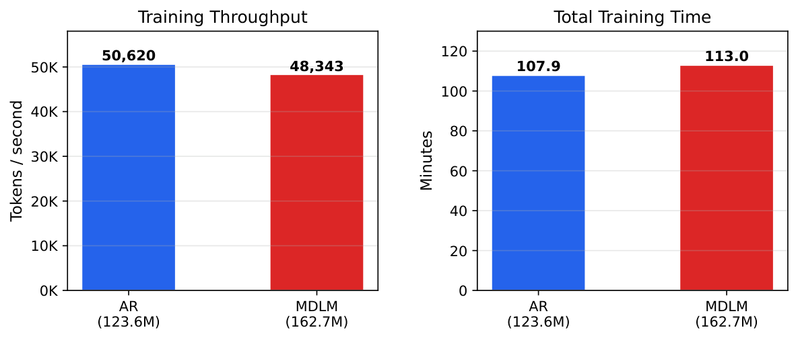
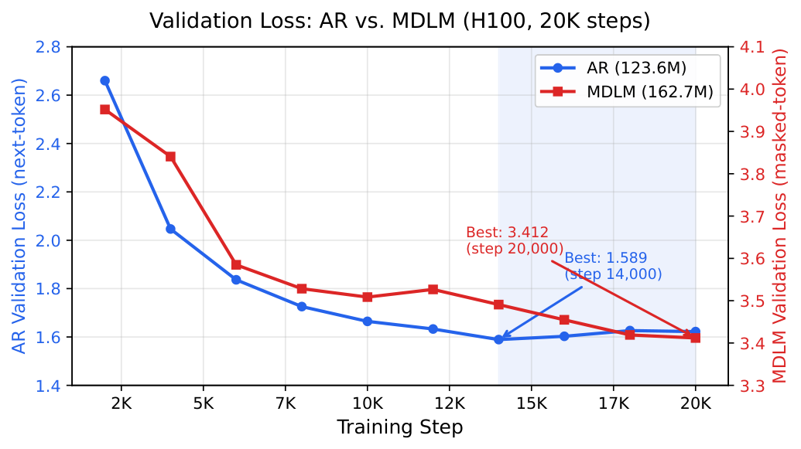

# Autoregressive vs. Masked Diffusion Language Models: A Controlled Comparison

> **一句话总结**：在严格控制数据、算力和硬件等变量的条件下，实证比较自回归（AR）与掩码扩散（MDLM）语言模型，发现两者训练吞吐量相当，但AR收敛更快且易过拟合，而MDLM生成文本在多样性上显著优于AR（93.4% vs 0.2%独特开头），揭示了生成范式中固有的多样性-流畅性权衡。

---

## 基本信息

| 项目 | 内容 |
|------|------|
| **作者** | Caio Vicentino |
| **arXiv** | [2603.22075](https://arxiv.org/abs/2603.22075) |
| **分类** | cs.CL |
| **PDF** | [链接](https://arxiv.org/pdf/2603.22075v1) |

---

## 研究动机与问题

### 核心问题

自回归（Autoregressive, AR）语言模型长期以来是文本生成的主流范式，而掩码扩散语言模型（Masked Diffusion Language Model, MDLM）作为一种新兴的非自回归生成方法，近年来受到越来越多的关注。然而，现有对比研究中往往存在以下混淆因素：

1. **训练数据差异**：不同模型使用不同规模和来源的训练数据，难以公平比较
2. **算力预算不一致**：训练步数、batch size、序列长度等超参数差异导致比较不公平
3. **硬件环境不同**：不同硬件平台的性能差异可能影响实验结论

### 现有方法的局限

- 大多数MDLM相关工作侧重于缩小与AR模型在困惑度（perplexity）上的差距，但缺乏对生成质量多个维度（特别是多样性）的系统评估
- 已有对比研究未能有效隔离"生成范式"这一核心变量，导致结论可能受到其他因素的干扰
- 对AR和MDLM在训练动态（如收敛速度、过拟合行为）上的差异缺乏深入分析

---

## 方法论

### 实验设计原则

本文的核心方法论贡献在于**严格控制实验变量**，确保自回归和掩码扩散两种范式之间的比较公平可靠。

### 统一实验条件

| 控制变量 | 设定 |
|----------|------|
| **训练数据** | TinyStories数据集，50M tokens |
| **训练步数** | 20,000步 |
| **Batch Size** | 32 |
| **序列长度** | 512 |
| **硬件** | NVIDIA H100 80GB |

### 两种生成范式

#### 自回归模型（AR）

- 标准的从左到右逐token生成方式
- 在每个时间步基于已生成的所有前序token预测下一个token
- 训练目标为标准的交叉熵损失

#### 掩码扩散语言模型（MDLM）

- 基于离散扩散过程的非自回归生成方式
- 前向过程：逐步将token替换为[MASK]
- 反向过程：学习从完全掩码的序列中逐步恢复原始文本
- 生成时可以并行预测多个位置的token

### 评估维度

1. **训练效率**：吞吐量（tokens/second）和wall-clock时间
2. **收敛行为**：损失曲线分析
3. **生成多样性**：基于1,000个生成样本的定量分析
   - 首词重复率
   - 5-gram开头唯一率
   - Distinct-n指标
   - Self-BLEU指标

---

## 实验结果

### 发现一：训练吞吐量相当

两种范式在相同硬件上实现了几乎相同的训练吞吐量：

| 指标 | AR | MDLM |
|------|-----|------|
| **吞吐量** | ~50K tokens/s | ~50K tokens/s |
| **额外时间开销** | 基准 | +4.7% |

MDLM仅需额外4.7%的wall-clock时间，表明掩码扩散训练在计算效率上并不比自回归方式显著更昂贵。

### 发现二：不同的收敛与过拟合行为

两种模型展现出截然不同的训练动态：

- **AR模型**：收敛速度更快，但在约第14,000步时开始出现过拟合现象
- **MDLM模型**：收敛速度较慢，在第20,000步时仍在持续改善，未出现过拟合迹象

这一发现表明两种范式可能需要**不同的计算最优训练策略**（compute-optimal training regimes）：AR模型需要更早停止训练或采用更强的正则化，而MDLM则可能从更长时间的训练中受益。

### 发现三：多样性-流畅性权衡

基于1,000个生成样本的定量分析揭示了两种范式之间的结构性差异：

| 指标 | AR | MDLM | 含义 |
|------|-----|------|------|
| **首词重复率** | 99.8%相同 | 更分散 | AR极度重复 |
| **5-gram开头唯一率** | 极低 | **93.4%** | MDLM多样性远超AR |
| **Distinct-n** | 较低 | **更高** | MDLM词汇多样性更强 |
| **Self-BLEU** | 较高 | **更低** | MDLM样本间相似度更低 |
| **语法流畅性** | 更优 | 偶有语法不一致 | AR流畅性更好 |

### 关键发现

1. **AR模型的退化问题**：99.8%的生成样本以相同的词开头，反映出严重的模式坍缩（mode collapse）现象，这是自回归采样中已知的问题
2. **MDLM的多样性优势**：93.4%的独特5-gram开头和更高的Distinct-n分数表明，掩码扩散在探索输出空间方面具有天然优势
3. **质量代价**：MDLM的高多样性伴随着偶发的语法不一致问题，这是并行生成方式的固有挑战——各位置的预测之间缺乏严格的因果依赖

---

## 深度分析

### 创新点

1. **严格的实验控制**：这是少数真正将"生成范式"作为唯一变量进行隔离比较的研究，实验设计值得肯定
2. **多维度评估框架**：不仅关注传统的困惑度/损失指标，还引入多样性指标进行全面评估
3. **训练动态分析**：揭示了AR和MDLM在收敛行为和过拟合特性上的本质差异，为两种范式的训练策略优化提供了实证依据
4. **多样性-流畅性权衡的量化**：首次以严格控制变量的方式量化了这一权衡关系

### 局限性

1. **规模有限**：50M tokens的训练数据和20K步的训练预算属于极小规模实验，结论能否推广到大规模预训练场景存疑
2. **单一数据集**：仅使用TinyStories数据集（儿童故事领域），领域特异性可能影响结论的泛化性
3. **缺乏下游任务评估**：未在具体的NLP下游任务（如问答、摘要等）上评估两种模型的实际应用性能
4. **AR采样策略单一**：AR模型的重复性问题可能部分源于采样策略（如temperature、top-k、top-p等参数的选择），论文未探讨不同采样策略对多样性的影响
5. **MDLM变体有限**：仅测试了一种MDLM实现，未比较不同扩散调度策略或去噪步数的影响
6. **缺乏人类评估**：多样性和流畅性的量化指标可能无法完全反映人类对生成文本质量的感知

### 与现有工作的关系

- **MDLM**（Sahoo et al., 2024）：本文实验中使用的掩码扩散语言模型基础架构
- **TinyStories**（Eldan & Li, 2023）：用于训练的小规模合成故事数据集，专为语言模型研究设计
- **Scaling Laws**（Hoffmann et al., 2022）：本文关于不同收敛行为的发现与计算最优训练的研究方向相关
- **文本多样性度量**（Li et al., 2016; Zhu et al., 2018）：Distinct-n和Self-BLEU等多样性指标的原始出处

---

## 技术细节备注

### AR模型的模式坍缩

99.8%的首词重复率是一个极端的数字。在自回归生成中，每个token的选择都依赖于前序token，这种串行依赖结构意味着：
- 如果模型对第一个token的概率分布非常集中（peaked），后续所有token都会被"锁定"在相似的轨迹上
- 这种行为在小数据集上可能更为严重，因为模型更容易记住训练数据中的常见模式

### MDLM的并行生成特性

MDLM的多样性优势来源于其生成机制：
- 各位置的token可以独立或半独立地被预测
- 不存在从左到右的严格顺序约束
- 但这也导致了token之间的一致性问题，因为缺乏显式的因果依赖

### 计算最优训练的启示

两种模型不同的过拟合行为意味着：
- 在固定计算预算下，AR模型可能需要更大的数据集或更强的正则化
- MDLM模型在相同数据规模下有更大的训练余量，可能更适合数据受限的场景
- Chinchilla-style的scaling law研究可能需要针对不同生成范式分别建立

---

## 总结与启发

### 核心贡献

本文通过严格控制实验变量，首次以公平可靠的方式揭示了自回归和掩码扩散语言模型之间的三个关键差异：（1）训练效率相当；（2）收敛与过拟合行为不同；（3）存在结构性的多样性-流畅性权衡。这些发现为理解两种生成范式的本质特性提供了有价值的实证证据。

### 未来方向

1. **扩大实验规模**：在更大的数据集（数十亿tokens）和更长的训练周期下验证结论的可扩展性
2. **采样策略探索**：系统研究不同采样策略（nucleus sampling、temperature scaling等）对AR模型多样性的改善效果
3. **混合范式**：探索结合AR和MDLM优势的混合生成方法，如先用MDLM生成草稿再用AR进行精修
4. **下游任务评估**：在实际应用场景中比较两种范式的表现
5. **Scaling Law研究**：分别为AR和MDLM建立计算最优训练的缩放规律
6. **MDLM一致性改进**：研究如何在保持多样性优势的同时提升MDLM的语法一致性

### 阅读价值

本文是理解自回归与扩散语言模型本质差异的优秀入门材料。实验设计简洁清晰，控制变量严谨，结论直观易懂。对于关注**扩散语言模型**发展方向的研究者，本文提供了重要的基准参考。对于实践者而言，多样性-流畅性权衡的发现可以指导在不同应用场景下选择合适的生成范式。

---

## 相关论文

- Sahoo et al. (2024) - MDLM: 掩码扩散语言模型
- Eldan & Li (2023) - TinyStories: 小规模语言模型训练数据集
- Hoffmann et al. (2022) - Chinchilla: 计算最优训练
- Li et al. (2016) - Distinct-n多样性指标
- Zhu et al. (2018) - Self-BLEU文本多样性评估
- Austin et al. (2021) - D3PM: 离散去噪扩散概率模型

---

*分析日期：2026-03-24 | 自动生成*
