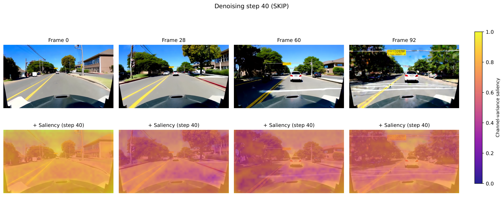
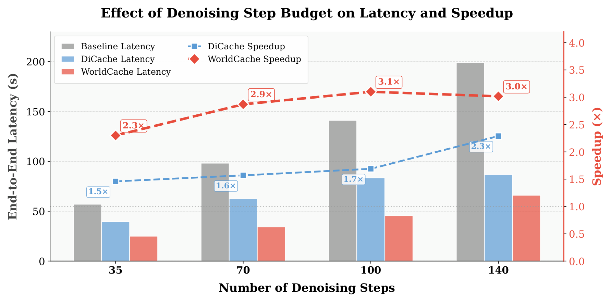

# WorldCache: Content-Aware Caching for Accelerated Video World Models

> **一句话总结**：WorldCache 提出了一种感知约束的动态缓存框架，通过运动自适应阈值、显著性加权漂移估计、混合-扭曲最优近似以及阶段感知阈值调度四大核心机制，在无需重训练的前提下实现视频世界模型 2.3 倍推理加速，同时保持 99.4% 的基线质量。

---

## 基本信息

| 属性 | 内容 |
|------|------|
| **作者** | Umair Nawaz, Ahmed Heakl, Ufaq Khan, Abdelrahman Shaker, Salman Khan, Fahad Shahbaz Khan |
| **arXiv** | [2603.22286](https://arxiv.org/abs/2603.22286) |
| **分类** | cs.CV, cs.AI, cs.CL, cs.LG |
| **发表时间** | 2026年3月 |
| **分析日期** | 2026-03-24 |

---

## 研究动机与问题

### 核心问题

Diffusion Transformers (DiTs) 已成为高保真视频世界模型的核心驱动力，但由于**顺序去噪过程**和**高代价的时空注意力计算**，推理效率极低。对于实时或交互式场景（如自动驾驶仿真、游戏引擎等），这种计算瓶颈严重制约了视频世界模型的实际部署。

### 现有方法的局限性

**无训练特征缓存 (Training-free Feature Caching)** 是一种通过在去噪步骤之间复用中间激活来加速推理的方法。然而，现有缓存方法普遍依赖 **零阶保持假设 (Zero-Order Hold Assumption)**，即：

1. **静态快照复用**：当全局漂移较小时，直接复用缓存特征作为静态快照
2. **鬼影伪影 (Ghosting Artifacts)**：在动态场景中，零阶保持假设导致运动物体出现鬼影
3. **模糊与运动不一致**：静态复用无法捕捉帧间运动变化，导致画面模糊和运动不连贯
4. **缺乏内容感知**：现有方法未区分场景中不同区域的运动特性和感知重要性，缓存策略过于粗糙

### 本文的洞察

特征缓存的关键不仅在于"何时复用"（when to reuse），更在于"如何复用"（how to reuse）。需要一种**感知约束的动态缓存**策略，能够根据场景内容的运动特性和视觉显著性自适应调整缓存行为。

---

## 方法：WorldCache 框架

### 整体架构

WorldCache 是一个 **感知约束的动态缓存框架 (Perception-Constrained Dynamical Caching)**，包含四个核心组件，形成一个自适应、运动一致的特征复用系统：


### 核心组件详解

#### 1. 运动自适应阈值 (Motion-Adaptive Thresholds)

传统方法使用固定阈值判断是否复用缓存，但不同场景的运动强度差异极大：

- **低运动场景**（如静态背景）：可以容忍更积极的缓存复用
- **高运动场景**（如快速运动物体）：需要更频繁地更新特征

WorldCache 根据场景的运动特性动态调整缓存阈值：
- 分析相邻帧间的特征漂移程度
- 运动剧烈区域使用更严格的阈值（更频繁计算）
- 运动平缓区域使用更宽松的阈值（更积极缓存）

#### 2. 显著性加权漂移估计 (Saliency-Weighted Drift Estimation)

并非所有像素区域对感知质量的贡献都相同。WorldCache 引入显著性图来加权特征漂移的估计：

- 对视觉显著区域（如前景物体、纹理丰富区域）赋予更高权重
- 对非显著区域（如均匀背景）赋予较低权重
- 加权后的漂移估计更准确地反映了人类感知的质量变化



这种设计确保了缓存决策与人类视觉感知对齐——即使全局漂移较小，如果显著区域发生变化，也会触发重新计算。

#### 3. 混合与扭曲的最优近似 (Optimal Approximation via Blending and Warping)

这是 WorldCache 超越零阶保持假设的关键创新。当决定复用缓存时，不是简单地"原样复用"，而是通过两种机制改进复用质量：

- **特征混合 (Blending)**：将缓存特征与当前步骤的部分计算结果进行加权混合，减少累积误差
- **特征扭曲 (Warping)**：根据估计的运动场对缓存特征进行空间变换，使其与当前帧的空间结构对齐

这两种机制共同确保了复用的特征不是"静态快照"，而是经过运动补偿的"动态近似"。

#### 4. 阶段感知阈值调度 (Phase-Aware Threshold Scheduling)

扩散模型的去噪过程可以分为不同阶段，每个阶段对特征精度的要求不同：

- **早期去噪步骤**：负责建立全局结构，对特征精度要求较低，可以更积极地缓存
- **中期去噪步骤**：负责细化内容，需要适度的缓存策略
- **后期去噪步骤**：负责精细细节生成，对特征精度要求最高，应减少缓存

WorldCache 根据当前所处的扩散阶段自动调整阈值，实现整个去噪过程的计算预算最优分配。

---

## 视频世界模型背景


视频世界模型旨在根据当前状态和动作预测未来的视觉帧，类似于"在模型内部构建物理世界的模拟器"。基于 Diffusion Transformer 的视频世界模型（如 Cosmos）通过去噪过程生成未来帧，但这一过程通常需要数十步迭代，每步都涉及大量的时空注意力计算，计算开销巨大。

---

## 实验设计

### 评估平台

- **模型**：Cosmos-Predict2.5-2B（20亿参数的视频世界模型）
- **基准**：PAI-Bench（视频世界模型评估基准）

### 评估指标

- **推理加速比 (Speedup)**：相对于无缓存基线的加速倍数
- **质量保持率 (Quality Retention)**：相对于基线的生成质量百分比
- **多维质量指标**：包括视觉保真度、运动一致性、时间连贯性等

---

## 实验结果

### 主要结果

| 指标 | 结果 |
|------|------|
| 推理加速比 | **2.3x** |
| 基线质量保持率 | **99.4%** |
| 重训练需求 | 无（Training-free） |

### 定性结果对比


### 步数预算消融实验



### 关键发现

1. **高效加速**：2.3 倍推理加速意味着近 57% 的计算可被安全跳过，这对于视频世界模型的实际部署意义重大
2. **质量近乎无损**：99.4% 的质量保持率表明 WorldCache 的四大组件协同工作，有效避免了传统缓存方法的鬼影、模糊等问题
3. **无需重训练**：作为即插即用的推理加速方案，可直接应用于已有的 DiT 视频世界模型，无需修改模型架构或重新训练
4. **运动自适应性**：在动态场景和静态场景中均表现良好，证明了运动自适应阈值的有效性

---

## 深度分析

### 核心创新点

1. **突破零阶保持假设**：首次系统性地解决了特征缓存中零阶保持假设带来的运动不一致问题，提出混合与扭曲的动态近似方案
2. **感知对齐的缓存决策**：通过显著性加权漂移估计，使缓存决策与人类视觉感知对齐，而非依赖简单的全局特征差异
3. **四组件协同设计**：运动自适应阈值、显著性加权、混合扭曲、阶段调度四个组件形成完整的缓存框架，覆盖了"何时复用"和"如何复用"两个关键维度
4. **扩散阶段感知**：利用扩散模型去噪过程的内在特性（早期粗糙、后期精细），在不同阶段采用不同的缓存策略，最大化计算预算利用率

### 局限性

1. **单一模型评估**：仅在 Cosmos-Predict2.5-2B 上评估，缺乏在其他视频世界模型（如 Sora、WALT 等）上的验证
2. **加速比上限**：2.3 倍加速虽显著，但对于实时应用（如 30fps 视频生成）可能仍不够，需要与其他加速技术（如蒸馏、量化）结合
3. **运动估计的鲁棒性**：在极端运动场景（如快速镜头切换、场景突变）下，运动自适应阈值和扭曲操作的鲁棒性未充分讨论
4. **显著性图的计算开销**：显著性加权漂移估计本身需要额外计算，需关注其开销是否影响实际加速效果
5. **长视频生成**：缓存策略在长视频（数百帧以上）生成中是否存在累积误差，论文未深入探讨

### 与现有工作的关系

- **特征缓存方法**（如 DeepCache、TGATE）：WorldCache 在此基础上引入内容感知机制，从"固定策略缓存"升级为"自适应动态缓存"
- **扩散模型加速**：与蒸馏（如 Progressive Distillation）、步数减少（如 DDIM、DPM-Solver）等正交，可以结合使用
- **视频世界模型**（如 Cosmos、UniSim）：WorldCache 作为推理加速插件，直接服务于这些模型的部署需求
- **光流与运动估计**：特征扭曲机制借鉴了视频理解中的光流技术，将其应用于扩散特征空间

---

## 技术细节备注

### Diffusion Transformer (DiT) 的计算瓶颈

- DiT 使用 Transformer 架构处理时空 token，注意力计算复杂度为 $O(n^2)$（$n$ 为 token 数量）
- 视频数据的 token 数量 = 帧数 x 空间分辨率，远大于图像
- 去噪过程需要 20-50 步迭代，每步都进行完整的前向传播

### 零阶保持假设的数学描述

零阶保持假设：$f_t \approx f_{t-k}$（在去噪步骤 $t$ 直接复用 $k$ 步前的缓存特征）

WorldCache 改进为：$f_t \approx \alpha \cdot \text{Warp}(f_{t-k}, \Delta m) + (1-\alpha) \cdot g_t$

其中 $\Delta m$ 为估计的运动场，$g_t$ 为当前步骤的部分计算结果，$\alpha$ 为自适应混合系数。

### 阶段感知调度策略

扩散去噪过程中，不同时间步的噪声水平不同：
- 高噪声步骤（$t$ 接近 $T$）：特征变化快但对全局结构影响大 -> 适度缓存
- 中噪声步骤：特征相对稳定 -> 积极缓存
- 低噪声步骤（$t$ 接近 0）：精细细节生成 -> 保守缓存

---

## 总结与启发

### 核心贡献

WorldCache 系统性地解决了视频世界模型中特征缓存的核心挑战——如何在加速推理的同时保持运动一致性和感知质量。其四组件协同设计（运动自适应阈值 + 显著性加权 + 混合扭曲 + 阶段调度）为"内容感知缓存"提供了完整的方法论框架。

### 未来方向

1. **多模型泛化验证**：在更多 DiT 视频模型上验证框架的通用性
2. **与其他加速技术结合**：探索与模型蒸馏、量化、稀疏注意力等方法的协同效果
3. **自适应计算预算分配**：根据场景复杂度动态调整整体计算预算
4. **长视频生成的累积误差控制**：设计周期性校准机制防止缓存误差累积
5. **实时视频世界模型**：结合硬件优化，推向实时交互式应用

### 阅读价值

本文适合关注**视频生成加速**、**扩散模型推理优化**和**视频世界模型部署**的研究者和工程师。方法设计直觉清晰，四个组件各有明确动机，且作为无训练方案具有很强的实用性。2.3 倍加速配合 99.4% 质量保持的结果具有说服力，是推理加速领域的有价值工作。

---

## 相关论文

- Peebles & Xie (2023) - Scalable Diffusion Models with Transformers (DiT)
- Ma et al. (2024) - DeepCache: Accelerating Diffusion Models with Deep Feature Caching
- NVIDIA (2025) - Cosmos World Foundation Models
- Song et al. (2021) - DDIM: Denoising Diffusion Implicit Models
- Lu et al. (2022) - DPM-Solver: Fast ODE Solver for Diffusion Models

---

## 引用

```bibtex
@article{nawaz2026worldcache,
  title={WorldCache: Content-Aware Caching for Accelerated Video World Models},
  author={Nawaz, Umair and Heakl, Ahmed and Khan, Ufaq and Shaker, Abdelrahman and Khan, Salman and Khan, Fahad Shahbaz},
  journal={arXiv preprint arXiv:2603.22286},
  year={2026}
}
```

---

*分析日期：2026-03-24 | 自动生成*
